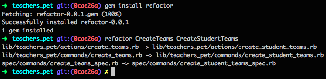

# Refactor

A command line tool to help refactor your code.



## Usage

Make sure your code is backed up (e.g. under version control and fully committed) first!

```bash
gem install refactor
# Then, from your project (sub)directory:
refactor FROM TO
```

where `FROM` and `TO` can each be a name that `has_underscores`, is `CamelCased`, or `has-dashes`.  It will replace the `FROM` with the `TO` in the corresponding format, both in the filenames and the body of the file.
